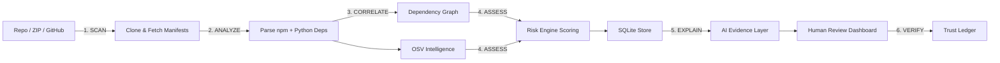
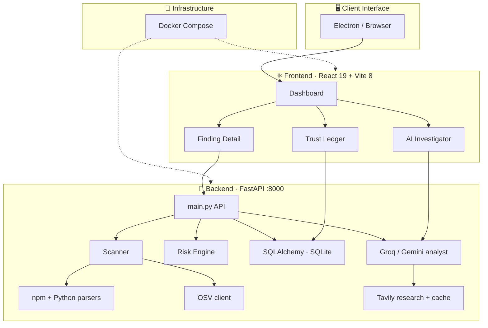

<div align="center">

# ⬢ ATOMCHAIN

### AtomChain · Local-first supply-chain security, on your machine.


<div align="center">

[](#)
[](#)
[](#-getting-started)

</div>

---

## 🧭 What is it?

**AtomChain** is an AI-powered platform that scans GitHub or local repositories to detect vulnerable or suspicious dependencies, assess risk, and provide evidence-based remediation recommendations for human review. 

A **blockchain-inspired Trust Ledger** securely records scan results and security decisions to ensure integrity and traceability. The platform supports **npm and Python** ecosystems out-of-the-box, providing a seamless pipeline from dependency parsing to AI-assisted security triaging.

---

## ✨ Capabilities at a glance

| Marker | Capability | Where |
|--------|-----------|-------|
|  | Clone & scan **public/private GitHub repos** (OAuth or PAT) | `backend/scanner/` |
|  | Scan **local directories** or **ZIP uploads** | `backend/scanner/zip_manager.py` |
|  | Parse `package.json` / `package-lock.json` manifests | `backend/parsers/npm_parser.py` |
|  | Parse Python dependency manifests & requirements | `backend/parsers/python_parser.py` |
|  | External vulnerability intelligence via **OSV.dev** | `backend/intelligence/osv_client.py` |
|  | Contextual priority scoring + dependency **graph / blast radius** | `backend/risk/` · `backend/dependency/` |
|  | **Groq / Gemini** analyst + **Tavily** web research for explainable assessment | `intelligence/` |
|  | Tamper-evident **Trust Ledger** for history of SBOMs and remediation | `backend/trust/ledger.py` |
|  | **Electron / Docker** application bundling | `frontend/` · `docker-compose.yml` |

---

## 🔄 Architecture & Workflow



---

## 🏗️ Technical Architecture



---

## 🛠️ Tech stack

[](https://react.dev)
[](https://vitejs.dev)
[](https://www.electronjs.org)
[](https://tailwindcss.com)
[](https://fastapi.tiangolo.com)
[](https://python.org)
[](https://sqlite.org)
[](https://docker.com)
[](https://groq.com)
[](https://ai.google.dev)

---

## 📦 Getting started

### Prerequisites
- [Docker](https://www.docker.com/) & Docker Compose (Recommended)
- **OR** [Node.js](https://nodejs.org) **20+** & [Python](https://python.org) **3.11+**

### 🐳 1 · Recommended: Run with Docker Compose

The easiest way to run the entire stack (Backend + Frontend) is via Docker.

```bash
docker-compose up --build
```

- API Server: `http://localhost:8000`
- React Dashboard: `http://localhost:5173`

> 🔑 **Important:** Before running, copy `backend/.env.example` to `backend/.env` and add your API keys — see [Environment](#-environment-variables).

### 2 · Manual Setup: Backend (FastAPI)

```bash
cd backend
python -m venv .venv
.venv\Scripts\activate                 # Windows · use .venv/bin/activate on macOS/Linux
pip install -r requirements.txt
python main.py                         # → http://127.0.0.1:8000
```

### 3 · Manual Setup: Frontend (Vite)

```bash
cd frontend
npm install
npm run dev                            # → http://localhost:5173
```

### 4 · 🖥️ Run as a desktop app (Electron)

```bash
cd frontend
npm run electron:dev                   # boots Vite + launches Electron, Python included
```

`npm run electron:build` produces an installer (`.exe` via NSIS) in `frontend/dist-electron/`.

---

## 🔑 Environment variables

Located in `backend/.env`:

| Variable | Required | Purpose |
|---|---|---|
| `GITHUB_CLIENT_ID` · `GITHUB_CLIENT_SECRET` · `GITHUB_OAUTH_CALLBACK_URL` | ✅ | GitHub OAuth sign-in |
| `GROQ_API_KEY_1` / `GROQ_API_KEY_2` | ✅ | Groq-based AI analyst |
| `GEMINI_API_KEY_1` | optional | Gemini fallback for the investigator |
| `TAVILY_API_KEY` | ✅ | Real-time web research on findings |

---

## 📁 Repository structure

```text
AtomChain/
├── backend/              # FastAPI server, scanners, risk + trust engines
│   ├── scanner/          #   Git clone, GitHub API, ZIP ingestion
│   ├── parsers/          #   npm & Python manifest parsers
│   ├── risk/             #   Severity / blast-radius scoring
│   ├── dependency/       #   Dependency graph builder (NetworkX)
│   ├── trust/            #   Vetted dependency Trust Ledger
│   └── ai/               #   AI investigator (Gemini/Groq)
├── intelligence/         # Shared engine layer
│   ├── ai/               #   Analyst prompts + schemas
│   ├── research/         #   Tavily client, query builder, source ranking
│   └── cache.py          #   TTL cache for research & lookups
├── frontend/             # React 19 + Vite + Tailwind
│   ├── electron/         #   Desktop shell
│   ├── src/pages/        #   Dashboard, Finding Detail, Investigator, Trust Ledger, Login
│   └── src/components/   #   Finding panel, AI scan summary, graph views
├── docker-compose.yml    # Container orchestration
└── assets/               # README media
```

---

## 📜 NPM scripts

| Command | What it does |
|---|---|
| `npm run dev` | Vite dev server (browser) |
| `npm run build` | Production frontend build |
| `npm run lint` | Static analysis via **Oxlint** |
| `npm run electron:dev` | **Desktop mode** — Vite + Electron + Python |
| `npm run electron:build` | Package installer via **electron-builder** (NSIS) |

---

## 🗺️ Roadmap & Future Scope

- [x] GitHub / local / ZIP source ingestion
- [x] npm + Python manifest parsing
- [x] OSV vulnerability lookup
- [x] Risk scoring + dependency graph
- [x] Local-first SQLite persistence
- [x] Electron desktop packaging
- [x] Docker deployment reproducibility
- [x] Tree-sitter / Code-level reachability analysis
- [ ] More ecosystems (Maven, Go, containers)
- [ ] CI/CD and PR-level continuous assessment
- [ ] Policy engine for organization-specific risk

---

## ⚖️ License

Local open-source edition for the community. Runs entirely on your machine — see the bundled
[Terms of Service](TERMS_OF_SERVICE.md) and [Privacy Policy](PRIVACY_POLICY.md).

<div align="center">

**Built with** ❤️ **+  ·  ·  · **

</div>
